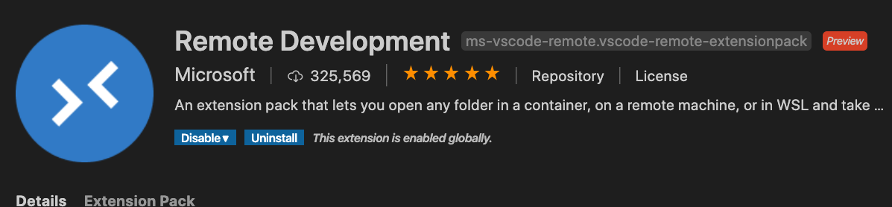
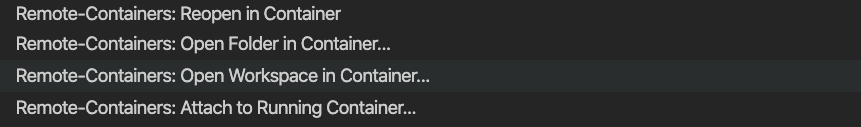
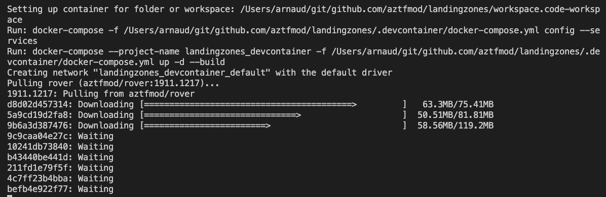
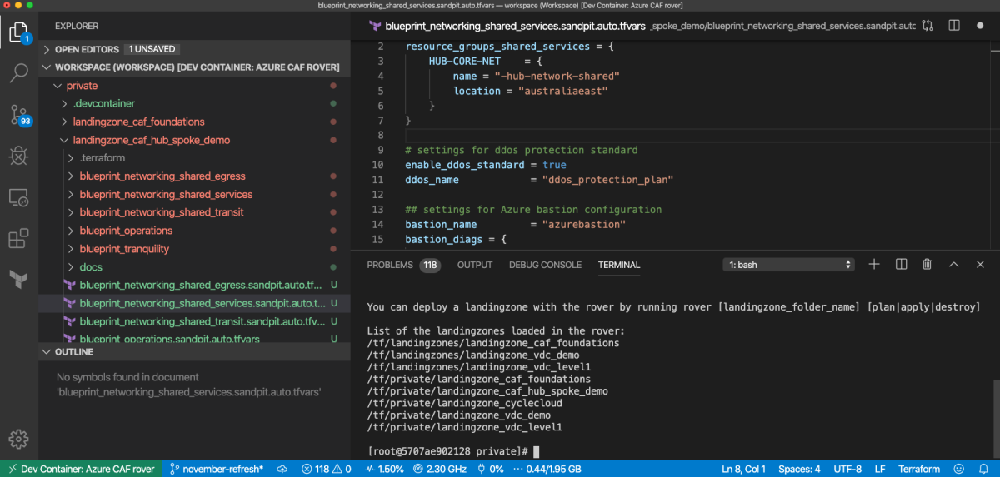

# Getting stated with the developer workspace

## Prerequisites

In order to have a consistent experience during development, the following tools are needed:

- [AWS CLI](https://docs.aws.amazon.com/cli/latest/userguide/install-cliv2.html)
- [Docker Desktop](https://docs.docker.com/docker-for-windows/install/)
- [Git](https://git-scm.com/downloads)
- [Visual Studio Code](https://code.visualstudio.com/)

You can deploy it easily on Windows and MacOS with the following software managers:

| MacOS  | Windows |  
| ------ | ------- |
| ```brew cask install visual-studio-code docker awscli``` <br /> ```brew install git``` | [Install Chocolatey](https://chocolatey.org/docs/installation) <br /> ```choco install git vscode docker-desktop awscli``` |

Once installed, open **Visual Studio Code** and install the "**Remote Development**" extension as follows: 

Finally, ensure you are logged into the Elastic Container Repository (ECR), so that Docker can download the required containers. [Login to ECR](./docker_login.md)

## Cloning the repository

Cloning your first repository:

```bash
git clone https://itscocloud@dev.azure.com/itscocloud/DevOps/_git/level0-tfbootstrap
```

## Open the repository in Visual Studio Code

Open the repository you've just cloned in Visual Studio Code, click on the lower bar, green sign and in the palette opening on the top of Visual Studio Code Window, select **"Open Folder in container"** or **"Reopen in container"**



The first time this should take a while, in the meantime, feel free to click on Details to see the container being downloaded from the registry and being connected to yur local environment:



You will have to accept local mapping to your filesystem when Docker prompts you (here's [how you reconfigure Docker Desktop to allow fileshares](./img/caf_setup_docker_fileshares.png) ), so that you can access your files from your container.



After a while, your environment is ready, note on the lower left part of Visual Studio Code, that you are now in your nixrover, which is your environment to use the landing zones.

**You must be authenticated first**:
For that we will rely on AWS authentication as completed by AWS Cli, via browser method:

```bash
aws configure
```

## Deploying the DevOps requirements

On the first run, you need to ensure that the state storage has been configured and is pointing to the appropriate remote state. This will set S3 buckets to store the state files, and dynamoDB for lock. To make this easier, `tfinit` has been written as a bash shell to automate this process, to run instead of the traditional `terraform init`. A full flow will look similar to the below:

```bash
tfinit
terraform plan
terraform apply
```

[Back to summary](../README.md)